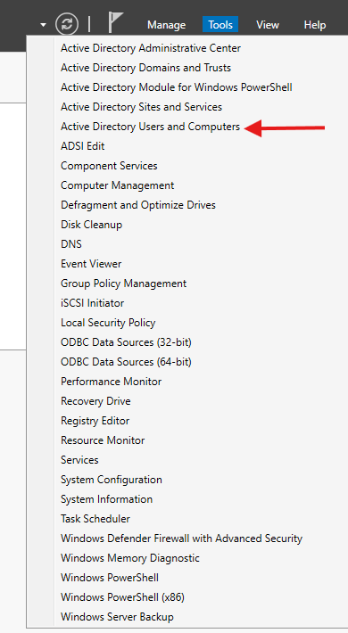
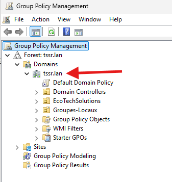
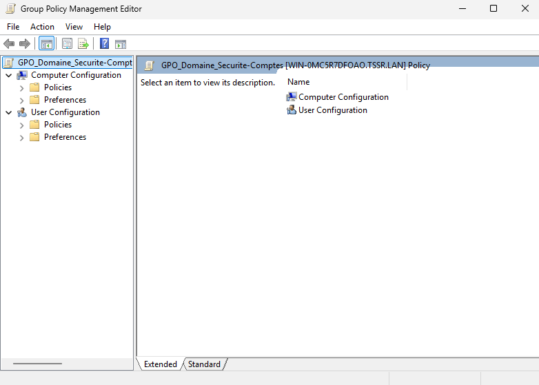
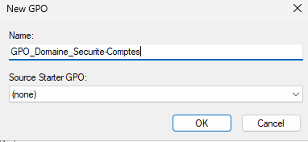
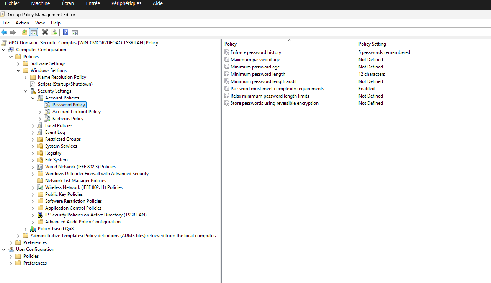
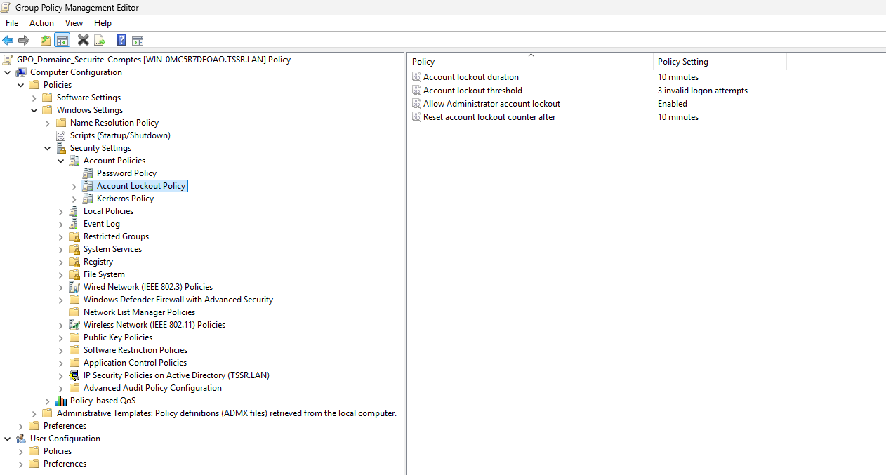
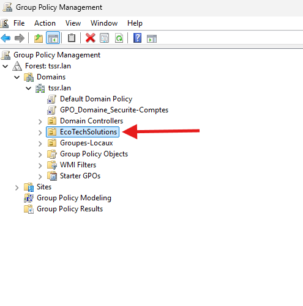
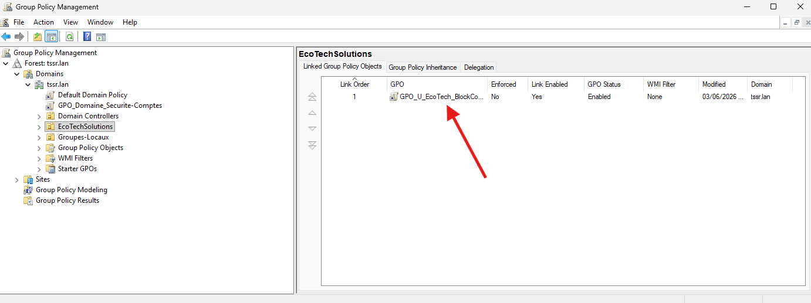
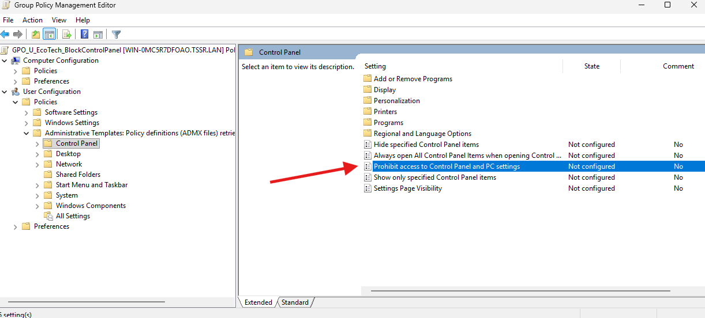
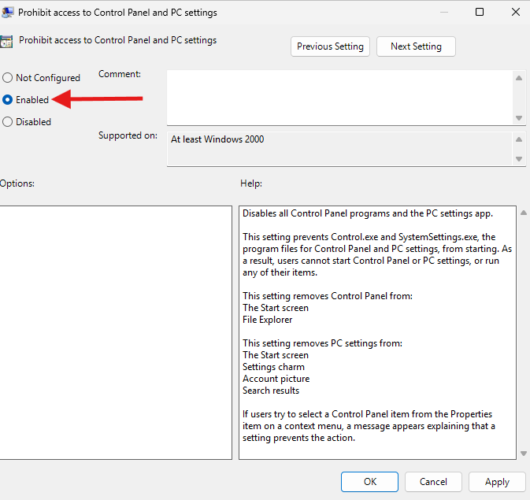

## Sommaire

* [1. Installation et promotion du contrôleur de domaine Active Directory (AD DS)](#1-installation-et-promotion-du-contrôleur-de-domaine-active-directory-ad-ds)
  
  * [a. Phase 1 : Installation des fichiers des rôles AD DS et DNS](#a-phase-1--installation-des-fichiers-des-rôles-ad-ds-et-dns)
    * [Étape 1 : Écran d'accueil de l'assistant](#étape-1--écran-daccueil-de-lassistant)
    * [Étape 2 : Choix du type d'installation](#étape-2--choix-du-type-dinstallation)
    * [Étape 3 : Sélection du serveur cible](#étape-3--sélection-du-serveur-cible)
    * [Étape 4 : Sélection des rôles à installer](#étape-4--sélection-des-rôles-à-installer)
    * [Étape 5 : Validation des fonctionnalités complémentaires](#étape-5--validation-des-fonctionnalités-complémentaires)
    * [Étape 6 : Écran d'information du Serveur DNS](#étape-6--écran-dinformation-du-serveur-dns)
    * [Étape 7 : Écran d'information AD DS](#étape-7--écran-dinformation-ad-ds)
    * [Étape 8 : Confirmation avant le lancement](#étape-8--confirmation-avant-le-lancement)
    * [Étape 9 : Progression de l'installation](#étape-9--progression-de-linstallation)
    * [Étape 10 : Fin de l'installation des composants](#étape-10--fin-de-linstallation-des-composants)
      
  * [b. Phase 2 : Assistant de Configuration et Promotion du Domaine](#b-phase-2--assistant-de-configuration-et-promotion-du-domaine)
    * [Étape 11 : Notification dans le Gestionnaire de serveur](#étape-11--notification-dans-le-gestionnaire-de-serveur)
    * [Étape 12 : Lancement de la promotion](#étape-12--lancement-de-la-promotion)
    * [Étape 13 : Configuration du déploiement de la forêt](#étape-13--configuration-du-déploiement-de-la-forêt)
    * [Étape 14 : Options du contrôleur de domaine et mot de passe DSRM](#étape-14--options-du-contrôleur-de-domaine-et-mot-de-passe-dsrm)
    * [Étape 15 : Options DNS (Message d'avertissement)](#étape-15--options-dns-message-davertissement)
    * [Étape 16 : Nom NetBIOS du domaine](#étape-16--nom-netbios-du-domaine)
    * [Étape 17 : Examen des options choisies](#étape-17--examen-des-options-choisies)
    * [Étape 18 : Vérification des prérequis et installation](#étape-18--vérification-des-prérequis-et-installation)
      
  * [c. Phase 3 : Finalisation, Redémarrage et Validation](#c-phase-3--finalisation-redémarrage-et-validation)
    * [Étape 19 : Notification de redémarrage automatique](#étape-19--notification-de-redémarrage-automatique)
    * [Étape 20 : Connexion au domaine d'entreprise](#étape-20--connexion-au-domaine-dentreprise)
    * [Étape 21 : Validation du Gestionnaire de serveur opérationnel](#étape-21--validation-du-gestionnaire-de-serveur-opérationnel)
      
* [2. Domaine AD DS](#2-domaine-ad-ds)
  
  * [Organisation AD DS](#organisation-ad-ds)
    * [Étape 1 : OU (Unités d'Organisation)](#étape-1--ou-unités-dorganisation)
    * [Étape 2 : Groupes (Implémentation de l'AGDLP)](#étape-2--groupes-implémentation-de-lagdlp)
    * [Étape 3 : Utilisateurs](#étape-3--utilisateurs)
      
  * [GPO (Objets de Stratégie de Groupe)](#gpo-objets-de-stratégie-de-groupe)
    * [1. Politique de mot de passe et verrouillage de compte](#1-politique-de-mot-de-passe-et-verrouillage-de-compte)
    * [2. Restriction d'accès au Panneau de configuration](#2-restriction-daccès-au-panneau-de-configuration)
    * [3. Gestion d'un compte administrateur local via GPO](#3-gestion-dun-compte-administrateur-local-via-gpo)
    * [4. Politique de sécurité PowerShell](#4-politique-de-sécurité-powershell)
    * [5. Verrouillage automatique de session](#5-verrouillage-automatique-de-session)
    * [6. Mappage de lecteur réseau](#6-mappage-de-lecteur-réseau)  

## 1. Installation et promotion du contrôleur de domaine Active Directory (AD DS)

Cette section détaille pas à pas l'installation des rôles AD DS et DNS sur le serveur `SRVWIN01`, suivie de sa promotion pour créer la racine de la forêt `tssr.lan`.

### a. Phase 1 : Installation des fichiers des rôles AD DS et DNS

Cette première phase permet de copier les dossiers et les outils d'administration nécessaires pour l'Active Directory et le DNS sur le disque local du serveur.

#### Étape 1 : Écran d'accueil de l'assistant
Dans le Gestionnaire de serveur, on clique sur "Ajouter des rôles et des fonctionnalités". L'assistant s'ouvre sur la page d'introduction "Before you begin". On clique sur Suivant.

#### Étape 2 : Choix du type d'installation
Sur l'écran "Select installation type", on sélectionne la première option : "Installation basée sur un rôle ou une fonctionnalité".

#### Étape 3 : Sélection du serveur cible
Sur l'écran "Select destination server", on choisit notre serveur `SRVWIN01` dans la liste.

#### Étape 4 : Sélection des rôles à installer
Sur l'écran "Select server roles", on coche la case "Services de domaine Active Directory" et la case "Serveur DNS". On valide l'ajout des outils de gestion (RSAT) pour les deux rôles.

#### Étape 5 : Validation des fonctionnalités complémentaires
Sur l'écran "Select features", il n'y a rien à modifier. Les composants requis par Windows Server sont déjà pré-cochés. On clique sur Suivant.

#### Étape 6 : Écran d'information du Serveur DNS
L'écran "DNS Server" affiche les informations spécifiques au rôle DNS et son intégration. On clique sur Suivant.

#### Étape 7 : Écran d'information AD DS
L'écran "AD DS" affiche les conseils et les remarques de Microsoft concernant les services d'annuaire. On clique sur Suivant.

#### Étape 8 : Confirmation avant le lancement
Sur l'écran "Confirmation", on vérifie la liste complète des composants et des consoles qui vont être installés, puis on clique sur le bouton "Installer".

#### Étape 9 : Progression de l'installation
La barre de progression avance pendant que Windows Server copie et installe les fichiers nécessaires aux deux rôles sur le disque.

#### Étape 10 : Fin de l'installation des composants
Une fois que l'installation des fichiers est terminée avec succès, on peut quitter cet assistant en cliquant sur le bouton "Close".

---

### b. Phase 2 : Assistant de Configuration et Promotion du Domaine

Cette deuxième phase permet de configurer la structure logique de notre annuaire Active Directory.

#### Étape 11 : Notification dans le Gestionnaire de serveur
De retour sur le tableau de bord principal du Gestionnaire de serveur, on remarque qu'un drapeau jaune de notification est apparu en haut à droite de l'interface.

#### Étape 12 : Lancement de la promotion
On clique sur ce drapeau jaune pour ouvrir le menu des tâches post-déploiement, puis on clique sur le lien "Promouvoir ce serveur en contrôleur de domaine" (Promote this server to a domain controller).

#### Étape 13 : Configuration du déploiement de la forêt
L'assistant de promotion s'ouvre sur l'écran "Deployment Configuration". Comme il s'agit du tout premier serveur de notre réseau, on coche "Ajouter une nouvelle forêt" (Add a new forest) et on saisit le nom obligatoire : `tssr.lan`.

#### Étape 14 : Options du contrôleur de domaine et mot de passe DSRM
Sur l'écran "Domain Controller Options", on conserve le niveau fonctionnel par défaut. On s'assure que les cases DNS et Catalogue Global sont cochées, puis on écrit un mot de passe sécurisé pour le mode de restauration de secours (DSRM).

#### Étape 15 : Options DNS (Message d'avertissement)
L'écran "DNS Options" affiche un message concernant la délégation DNS. Cet avertissement est tout à fait normal lors de la création d'une nouvelle zone racine isolée. On clique sur Suivant.

#### Étape 16 : Nom NetBIOS du domaine
Sur l'écran "Additional Options", le système examine notre saisie et attribue automatiquement le nom NetBIOS de notre domaine. On vérifie qu'il indique bien `TSSR` en majuscules.

#### Étape 17 : Examen des options choisies
L'écran "Review Options" affiche un résumé complet de tous les choix et paramètres techniques que nous avons configurés avant de lancer définitivement l'écriture sur le serveur.

#### Étape 18 : Vérification des prérequis et installation
Sur l'écran "Prerequisites Check", le système fait ses dernières vérifications de sécurité. Dès que l'icône de validation verte apparaît en haut pour confirmer la conformité, on clique sur le bouton "Installer". Le serveur configure le domaine puis redémarre automatiquement.

---

### c. Phase 3 : Finalisation, Redémarrage et Validation

#### Étape 19 : Notification de redémarrage automatique
Une fois la configuration terminée, une boîte de dialogue Windows s'affiche pour indiquer que la machine va se déconnecter et redémarrer automatiquement pour appliquer les modifications de l'Active Directory.

#### Étape 20 : Connexion au domaine d'entreprise
Après le redémarrage du serveur, on constate le succès de l'opération sur l'écran de verrouillage Windows qui propose désormais de se connecter avec le compte administrateur du domaine sous la forme `TSSR\Administrateur`.

#### Étape 21 : Validation du Gestionnaire de serveur opérationnel
Une fois la session ouverte, le tableau de bord du Gestionnaire de serveur s'affiche. On valide que les briques technologiques "AD DS" et "DNS" sont bien présentes, actives et totalement fonctionnelles dans le menu latéral gauche.

## 2. Domaine AD DS

### Organisation AD DS

Cette section détaille la structuration de l'annuaire Active Directory pour la société EcoTech Solutions, comprenant la création des Unités d'Organisation (OU), des comptes utilisateurs de test et l'implémentation de la stratégie de groupes AGDLP.

#### Étape 1 : OU (Unités d'Organisation)

Afin d'isoler les objets de production et de permettre l'application ciblée des futures stratégies de groupe (GPO), une structure d'OU hiérarchique a été mise en place.

1. Dans le **Gestionnaire de serveur**, ouvrir **Outils** > **Utilisateurs et ordinateurs Active Directory**.

2. Faire un clic droit sur la racine du domaine `tssr.lan` > **Nouveau** > **Unité d'organisation**.
3. Créer l'OU principale `EcoTechSolutions` en veillant à laisser cochée la protection contre la suppression accidentelle.
4. Sous l'OU `EcoTechSolutions`, créer les sous-OU correspondantes aux départements définis pour la phase de test :
   - `Service-Commercial`
   - `Service-RH`

#### Étape 2 : Groupes (Implémentation de l'AGDLP)

La stratégie AGDLP est appliquée pour sécuriser les futurs accès aux ressources.

1. **Création du Groupe Global (Fonction) :** Dans l'OU `Service-Commercial`, faire un clic droit > **Nouveau** > **Groupe**. Nommer le groupe `G_Service-Commercial_U` (Étendue : Globale / Type : Sécurité).
2. **Imbrication dans le Groupe Local de Domaine (Ressource) :** Un groupe local de domaine nommé `DL_Partage-Commercial_RW` est créé dans une OU dédiée aux ressources. Le groupe global `G_Service-Commercial_U` y est ensuite imbriqué comme membre.
3. Répéter l'opération pour le département `Service-RH` avec le groupe global `G_Service-RH_U`.

#### Étape 3 : Utilisateurs

Création de 6 utilisateurs répartis équitablement dans les deux départements pilotes, respectant la nomenclature officielle de l'entreprise.

1. Dans l'OU du département cible, faire un clic droit > **Nouveau** > **Utilisateur**.
2. Saisir les informations d'identité et définir le nom d'ouverture de session (SamAccountName) en minuscules, sans espace ni accent.
3. Définir un mot de passe provisoire et cocher obligatoirement la case **L'utilisateur doit changer le mot de passe à la prochaine ouverture de session** pour garantir la confidentialité des accès.
4. Intégrer les utilisateurs dans leurs groupes globaux respectifs (`G_Service-Commercial_U` ou `G_Service-RH_U`) selon leur affectation.

### GPO (Objets de Stratégie de Groupe)

Cette section détaille la mise en place des stratégies de sécurité et de restriction de l'environnement utilisateur. 

#### 1. Politique de mot de passe et verrouillage de compte

**Création et liaison de la stratégie :**
1. Ouvrir le **Server Manager**, puis cliquer sur **Tools** > **Group Policy Management**.
2. Dérouler l'arborescence jusqu'au domaine `tssr.lan`.

3. Faire un clic droit sur `tssr.lan` > **Create a GPO in this domain, and Link it here...**.
4. Nommer la stratégie : `GPO_Domaine_Securite-Comptes` et valider.

**Configuration de la politique de mots de passe :**
1. Faire un clic droit sur la nouvelle GPO > **Edit...**.
2. Naviguer dans l'arborescence suivante : 
   `Computer Configuration` > `Policies` > `Windows Settings` > `Security Settings` > `Account Policies` > `Password Policy`.

3. Paramétrer les éléments suivants :
   - **Password must meet complexity requirements** : Cochez *Enabled* (Exige un mélange de majuscules, minuscules, chiffres et caractères spéciaux).
   - **Minimum password length** : Définir sur *12 characters* (Norme minimale de sécurité recommandée).
   - **Enforce password history** : Définir sur *5 passwords remembered* (Empêche la réutilisation immédiate des anciens mots de passe).

**Configuration du verrouillage de compte (Anti-Bruteforce) :**
1. Toujours dans la section `Account Policies`, sélectionner le sous-dossier **Account Lockout Policy**.

2. Paramétrer l'élément suivant :
   - **Account lockout threshold** : Définir sur *3 invalid logon attempts* (Verrouille le compte après 3 échecs consécutifs).
3. Valider la fenêtre d'avertissement de Windows : le système configure automatiquement les paramètres liés (`Account lockout duration` et `Reset account lockout counter after`) sur 10 minutes par défaut.
4. Fermer l'éditeur (la sauvegarde s'applique automatiquement).

#### 2. Restriction d'accès au Panneau de configuration

Cette stratégie (GPO) illustre le principe de moindre privilège. Elle s'applique spécifiquement à l'environnement visuel de l'utilisateur afin de l'empêcher de modifier les paramètres systèmes, réseau ou de sécurité du poste client.

Conformément à la règle LSDOU, cette stratégie est liée directement sur l'Unité d'Organisation `EcoTechSolutions` pour qu'elle s'applique en cascade à tous les départements sous-jacents (Service-Commercial, Service-RH, etc.).

**Création et liaison de la stratégie :**
1. Ouvrir le **Server Manager**, puis cliquer sur **Tools** > **Group Policy Management**.
2. Dérouler l'arborescence jusqu'à l'OU `EcoTechSolutions`.

3. Faire un clic droit sur l'OU `EcoTechSolutions` > **Create a GPO in this domain, and Link it here...**.
4. Nommer la stratégie : `GPO_U_EcoTech_BlockControlPanel` et valider.

**Configuration du blocage :**
1. Faire un clic droit sur la nouvelle GPO > **Edit...**.
2. Naviguer dans l'arborescence suivante : 
   `User Configuration` > `Policies` > `Administrative Templates` > `Control Panel`.
3. Dans le panneau de droite, rechercher et double-cliquer sur le paramètre **Prohibit access to Control Panel and PC settings**.

4. Sélectionner le bouton **Enabled**.

5. Cliquer sur **Apply** puis sur **OK**.
6. Fermer l'éditeur (la sauvegarde s'applique automatiquement).

#### 3. Gestion d'un compte administrateur local via GPO

**Étape 1 : Création du compte dédié au support**
1. Ouvrir **Active Directory Users and Computers** via le Server Manager.
2. Naviguer jusqu'à l'Unité d'Organisation `EcoTechSolutions`.
3. Faire un clic droit dans le panneau central > **New** > **User**.
4. Renseigner les champs d'identité et définir le **User logon name** sur `admin_support`.
5. Assigner un mot de passe robuste.
6. Décocher l'obligation de changement de mot de passe et cocher impérativement **Password never expires**.
7. Valider la création du compte.

**Étape 2 : Création et liaison de la stratégie**
1. Ouvrir **Group Policy Management** via le Server Manager.
2. Dérouler l'arborescence jusqu'au domaine `tssr.lan` et identifier l'OU `EcoTechSolutions`.
3. Faire un clic droit sur l'OU `EcoTechSolutions` > **Create a GPO in this domain, and Link it here...**.
4. Nommer la stratégie `GPO_C_EcoTech_LocalAdmins` et valider.

**Étape 3 : Configuration de la préférence (GPP)**
1. Faire un clic droit sur la nouvelle GPO > **Edit...** pour ouvrir le Group Policy Management Editor.
2. Naviguer dans l'arborescence suivante (Configuration Ordinateur) : 
   `Computer Configuration` > `Preferences` > `Control Panel Settings` > `Local Users and Groups`.
3. Faire un clic droit dans l'espace vide du panneau central > **New** > **Local Group**.
4. Dans la fenêtre de propriétés, laisser le champ **Action** sur `Update`.
5. Dans le champ **Group name**, utiliser le menu déroulant pour sélectionner la variable universelle `Administrators (built-in)`.
6. Cliquer sur le bouton **Add...** en bas de la fenêtre.
7. Cocher **Add to this group**, saisir le nom d'utilisateur `tssr\admin_support` dans le champ, et valider par **OK**.
8. Cliquer sur **Apply** puis **OK**, et fermer l'éditeur de stratégie.

#### 4. Politique de sécurité PowerShell

**Création et liaison de la stratégie :**
1. Ouvrir **Group Policy Management** via le Server Manager.
2. Dérouler l'arborescence jusqu'au domaine `tssr.lan` et identifier l'OU `EcoTechSolutions`.
3. Faire un clic droit sur l'OU `EcoTechSolutions` > **Create a GPO in this domain, and Link it here...**.
4. Nommer la stratégie `GPO_C_EcoTech_Securite_PowerShell` et valider.

**Configuration de la stratégie d'exécution :**
1. Faire un clic droit sur la nouvelle GPO > **Edit...** pour ouvrir le Group Policy Management Editor.
2. Naviguer dans l'arborescence suivante (Configuration Ordinateur) : 
   `Computer Configuration` > `Policies` > `Administrative Templates` > `Windows Components` > `Windows PowerShell`.
3. Dans le panneau de droite, double-cliquer sur le paramètre **Turn on Script Execution**.
4. Dans la fenêtre de configuration :
   - Sélectionner le bouton radio **Enabled**.
   - Dans le menu déroulant *Execution Policy* (sous les options), sélectionner impérativement **Allow local scripts and remote signed scripts**.
5. Cliquer sur **Apply** puis **OK**.
6. Fermer l'éditeur de stratégie (la sauvegarde s'applique automatiquement sur les postes cibles).

#### 5. Verrouillage automatique de session

**Création et configuration de la stratégie :**
1. Ouvrir **Group Policy Management**.
2. Faire un clic droit sur l'OU `EcoTechSolutions` > **Create a GPO in this domain, and Link it here...**.
3. Nommer la stratégie `GPO_C_EcoTech_VerrouillageEcran` et valider.
4. Faire un clic droit sur la GPO > **Edit...**.
5. Naviguer dans l'arborescence (Configuration Ordinateur) : 
   `Computer Configuration` > `Policies` > `Windows Settings` > `Security Settings` > `Local Policies` > `Security Options`.
6. Dans le panneau de droite, double-cliquer sur **Interactive logon: Machine inactivity limit**.
7. Cocher **Define this policy setting** et définir la valeur sur `900` secondes (15 minutes).
8. Cliquer sur **Apply** puis **OK**. Fermer l'éditeur.

#### 6. Mappage de lecteur réseau

**Création et configuration de la stratégie :**
1. Ouvrir **Group Policy Management**.
2. Faire un clic droit sur l'OU `EcoTechSolutions` > **Create a GPO in this domain, and Link it here...**.
3. Nommer la stratégie `GPO_U_EcoTech_LecteurReseau` et valider.
4. Faire un clic droit sur la GPO > **Edit...**.
5. Naviguer dans l'arborescence (Configuration Utilisateur) : 
   `User Configuration` > `Preferences` > `Windows Settings` > `Drive Maps`.
6. Faire un clic droit dans le panneau central > **New** > **Mapped Drive**.
7. Dans les propriétés, configurer les paramètres suivants :
   - **Action :** `Update`
   - **Location :** `\\SRVWIN01\Partages`
   - **Label as :** `Commun`
   - **Drive Letter :** Cocher `Use:` et sélectionner la lettre `P`.
8. Cliquer sur **Apply** puis **OK**. Fermer l'éditeur.

## 3. Configuration du Serveur DNS

### a. Création des enregistrements de type A (Hôtes statiques)

Cette étape permet de lier manuellement le nom d'hôte (Hostname) des serveurs d'infrastructure à leur adresse IP statique au sein de la zone de recherche directe.

**Procédure de création :**
1. Ouvrir le **Server Manager** > **Tools** > **DNS**.
2. Dans le gestionnaire DNS, dérouler l'arborescence du serveur `SRVWIN01` > **Forward Lookup Zones**.
3. Sélectionner la zone principale du domaine : `tssr.lan`.
4. Faire un clic droit dans le panneau d'affichage des enregistrements > **New Host (A or AAAA)...**.
5. Pour chaque équipement d'infrastructure, renseigner :
   - **Name :** Le nom d'hôte de la machine (ex: `FW01`). Le FQDN se complète automatiquement.
   - **IP address :** L'adresse IPv4 statique allouée à l'équipement (ex: `172.16.20.254`).
6. Cocher obligatoirement la case **Create associated pointer (PTR) record** afin de générer simultanément l'enregistrement de résolution inverse pour Kerberos et les outils de supervision.
7. Cliquer sur **Add Host** pour valider la création.

**Liste des enregistrements statiques créés :**
* `FW01` -> `172.16.20.254` (Passerelle pfSense)
* `SRVWIN04` -> `172.16.20.12` (Serveur WSUS)
* `SRVLX01` -> `172.16.20.20` (Serveur GLPI / Messagerie)
* `IPBX01` -> `172.16.20.30` (Serveur VoIP)

## 4. Installation et Configuration du Service DHCP

### a. Prérequis et contexte technique
* **Serveur cible :** SRVWIN01
* **Rôle :** Serveur DHCP
* **Réseau concerné :** LAN (172.16.20.0/24)
* **Objectif :** Distribuer dynamiquement les configurations IP aux postes clients tout en réservant une plage d'adresses statiques pour l'infrastructure (serveurs, équipements réseaux).

### b. Installation du Rôle DHCP

1. Ouvrir le **Gestionnaire de serveur** (`Server Manager`).
2. Cliquer sur **Ajouter des rôles et des fonctionnalités** (`Add roles and features`).
3. Passer l'écran d'accueil en cliquant sur **Suivant**.
4. Sélectionner **Installation basée sur un rôle ou une fonctionnalité** et cliquer sur **Suivant**.
5. Sélectionner le serveur `SRVWIN01` dans le pool de serveurs et valider.
6. Dans la liste des rôles, cocher **Serveur DHCP** (`DHCP Server`).
7. Dans la fenêtre contextuelle, cliquer sur **Ajouter des fonctionnalités** (`Add Features`) pour inclure les outils RSAT nécessaires à l'administration. Cliquer sur **Suivant**.
8. Passer l'écran des fonctionnalités et de présentation du rôle DHCP en cliquant sur **Suivant**.
9. Cliquer sur **Installer** (`Install`). Ne pas fermer la fenêtre à la fin de l'installation.

### c. Configuration post-déploiement (Autorisation Active Directory)

*Cette étape est cruciale pour autoriser le serveur DHCP à opérer au sein du domaine Active Directory et éviter la prolifération de serveurs DHCP non autorisés (Rogue DHCP).*

1. Dans la fenêtre de fin d'installation, cliquer sur le lien **Terminer la configuration DHCP** (`Complete DHCP configuration`).
2. Sur l'écran de description, cliquer sur **Suivant**.
3. À l'étape d'autorisation, s'assurer que l'option **Utiliser les informations d'identification de l'utilisateur suivant** est sélectionnée avec le compte `tssr\Administrator`.
4. Cliquer sur **Valider** (`Commit`).
5. Vérifier que la création des groupes de sécurité et l'autorisation sont réussies ("Terminé" / "Done"), puis cliquer sur **Fermer**.

### d. Création et configuration de l'étendue (Scope) LAN

1. Depuis le **Gestionnaire de serveur**, cliquer sur le menu **Outils** (`Tools`) > **DHCP**.
2. Dans l'arborescence, dérouler `SRVWIN01.tssr.lan`, puis faire un clic droit sur **IPv4** et sélectionner **Nouvelle étendue...** (`New Scope...`).
3. Cliquer sur **Suivant**.
4. Renseigner les informations d'identification :
   * **Nom :** `LAN_EcoTech`
   * **Description :** `Plage DHCP pour le réseau utilisateur LAN`
5. Configurer la plage d'adresses IP :
   * **Adresse IP de début :** `172.16.20.100`
   * **Adresse IP de fin :** `172.16.20.200`
   * **Longueur :** `24` (Le masque de sous-réseau `255.255.255.0` s'applique automatiquement).
   * Cliquer sur **Suivant**.
6. **Ajout d'exclusions :** Laisser vide, la plage de `.1` à `.99` étant déjà exclue de par la définition de la plage initiale. Cliquer sur **Suivant**.
7. **Durée du bail :** Laisser la valeur par défaut de **8 jours**. Cliquer sur **Suivant**.
8. **Options DHCP :** Choisir **Oui, je veux configurer ces options maintenant** et cliquer sur **Suivant**.
9. **Routeur (Passerelle par défaut) :** Saisir l'adresse IP de l'interface LAN du pare-feu pfSense (`172.16.20.254`), cliquer sur **Ajouter**, puis sur **Suivant**.
10. **Nom de domaine et serveurs DNS :** * Vérifier que le domaine parent est `tssr.lan`.
    * S'assurer que l'adresse IP de `SRVWIN01` (`172.16.20.10`) figure dans la liste des serveurs DNS.
    * Cliquer sur **Suivant**.
11. **Serveurs WINS :** Laisser vide et cliquer sur **Suivant**.
12. **Activation de l'étendue :** Choisir **Oui, je veux activer cette étendue maintenant** et cliquer sur **Suivant**, puis **Terminer**.

### e. Validation des tests

* Démarrer une machine cliente (Windows 10/11) connectée au commutateur virtuel (LAN).
* Ouvrir l'invite de commande (`cmd`).
* Exécuter la commande `ipconfig /release` puis `ipconfig /renew`.
* Exécuter `ipconfig /all` pour vérifier la bonne attribution d'une IP (172.16.20.100+), du masque, de la passerelle et du serveur DNS.
