## Sommaire

* [Installation et Promotion du Contrôleur de Domaine Active Directory (AD DS)](installation-et-promotion-du-contrôleur-de-domaine-active-directory-ad-ds)
  * [a. Phase 1 : Installation des fichiers des rôles AD DS et DNS](#a-phase-1--installation-des-fichiers-des-rôles-ad-ds-et-dns)
    * [Étape 1 : Écran d'accueil de l'assistant](#étape-1--écran-daccueil-de-lassistant)
    * [Étape 2 : Choix du type d'installation](#étape-2--choix-du-type-dinstallation)
    * [Étape 3 : Sélection du serveur cible](#étape-3--sélection-du-serveur-cible)
    * [Étape 4 : Sélection des rôles à installer](#étape-4--sélection-des-rôles-à-installer)
    * [Étape 5 : Validation des fonctionnalités complémentaires](#étape-5--validation-des-fonctionnalités-complémentaires)
    * [Étape 6 : Écran d'information du Serveur DNS](#étape-6--écran-dinformation-du-serveur-dns)
    * [Étape 7 : Écran d'information AD DS](#étape-7--écran-dinformation-ad-ds)
    * [Étape 8 : Confirmation avant le lancement](#étape-8--confirmation-avant-le-lancement)
    * [Étape 9 : Progression de l'installation](#étape-9--progression-de-linstallation)
    * [Étape 10 : Fin de l'installation des composants](#étape-10--fin-de-linstallation-des-composants)
  * [b. Phase 2 : Assistant de Configuration et Promotion du Domaine](#b-phase-2--assistant-de-configuration-et-promotion-du-domaine)
    * [Étape 11 : Notification dans le Gestionnaire de serveur](#étape-11--notification-dans-le-gestionnaire-de-serveur)
    * [Étape 12 : Lancement de la promotion](#étape-12--lancement-de-la-promotion)
    * [Étape 13 : Configuration du déploiement de la forêt](#étape-13--configuration-du-déploiement-de-la-forêt)
    * [Étape 14 : Options du contrôleur de domaine et mot de passe DSRM](#étape-14--options-du-contrôleur-de-domaine-et-mot-de-passe-dsrm)
    * [Étape 15 : Options DNS (Message d'avertissement)](#étape-15--options-dns-message-davertissement)
    * [Étape 16 : Nom NetBIOS du domaine](#étape-16--nom-netbios-du-domaine)
    * [Étape 17 : Examen des options choisies](#étape-17--examen-des-options-choisies)
    * [Étape 18 : Vérification des prérequis et installation](#étape-18--vérification-des-prérequis-et-installation)
  * [c. Phase 3 : Finalisation, Redémarrage et Validation](#c-phase-3--finalisation-redémarrage-et-validation)
    * [Étape 19 : Notification de redémarrage automatique](#étape-19--notification-de-redémarrage-automatique)
    * [Étape 20 : Connexion au domaine d'entreprise](#étape-20--connexion-au-domaine-dentreprise)
    * [Étape 21 : Validation du Gestionnaire de serveur opérationnel](#étape-21--validation-du-gestionnaire-de-serveur-opérationnel)

## Installation et Promotion du Contrôleur de Domaine Active Directory (AD DS)

Cette section détaille pas à pas l'installation des rôles AD DS et DNS sur le serveur `SRVWIN01`, suivie de sa promotion pour créer la racine de la forêt `tssr.lan`.

### a. Phase 1 : Installation des fichiers des rôles AD DS et DNS

Cette première phase permet de copier les dossiers et les outils d'administration nécessaires pour l'Active Directory et le DNS sur le disque local du serveur.

#### Étape 1 : Écran d'accueil de l'assistant
Dans le Gestionnaire de serveur, on clique sur "Ajouter des rôles et des fonctionnalités". L'assistant s'ouvre sur la page d'introduction "Before you begin". On clique sur Suivant.

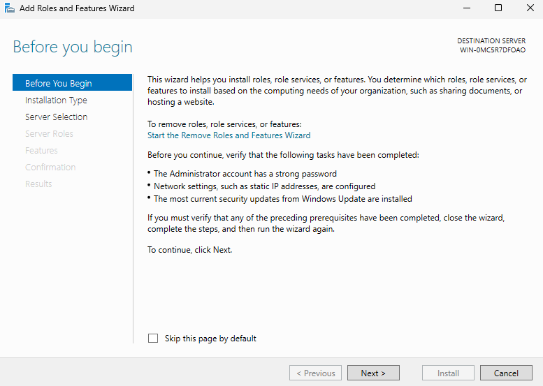

#### Étape 2 : Choix du type d'installation
Sur l'écran "Select installation type", on sélectionne la première option : "Installation basée sur un rôle ou une fonctionnalité".

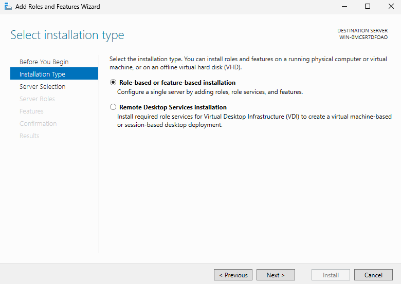

#### Étape 3 : Sélection du serveur cible
Sur l'écran "Select destination server", on choisit notre serveur `SRVWIN01` dans la liste.

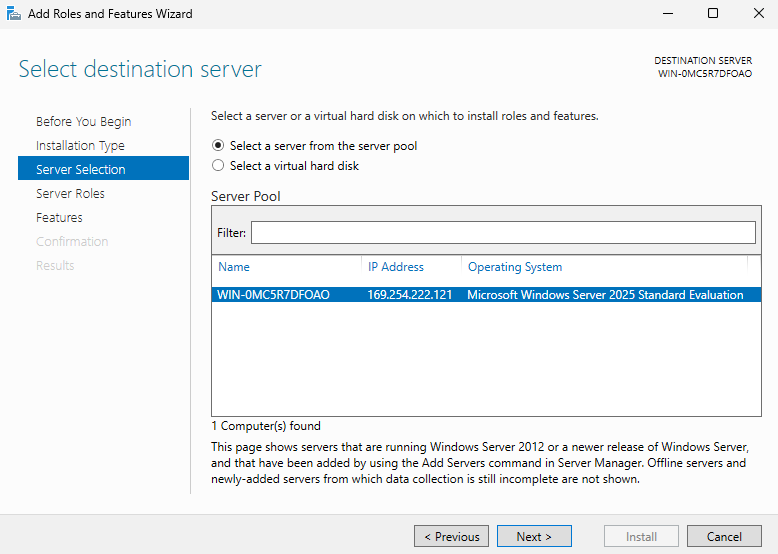

#### Étape 4 : Sélection des rôles à installer
Sur l'écran "Select server roles", on coche la case "Services de domaine Active Directory" et la case "Serveur DNS". On valide l'ajout des outils de gestion (RSAT) pour les deux rôles.

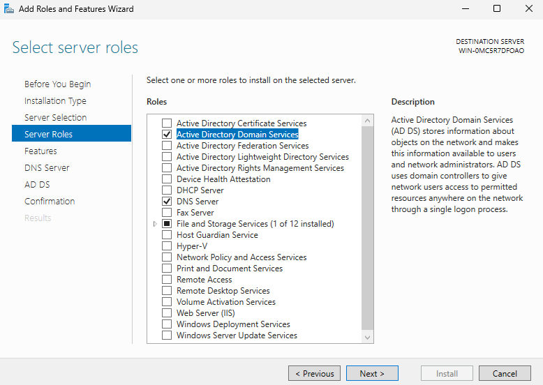

#### Étape 5 : Validation des fonctionnalités complémentaires
Sur l'écran "Select features", il n'y a rien à modifier. Les composants requis par Windows Server sont déjà pré-cochés. On clique sur Suivant.

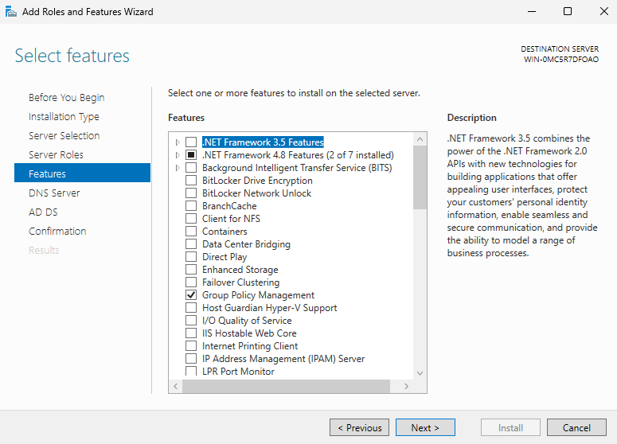

#### Étape 6 : Écran d'information du Serveur DNS
L'écran "DNS Server" affiche les informations spécifiques au rôle DNS et son intégration. On clique sur Suivant.

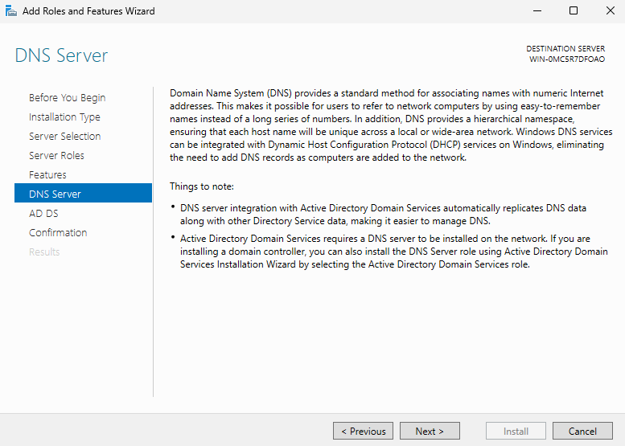

#### Étape 7 : Écran d'information AD DS
L'écran "AD DS" affiche les conseils et les remarques de Microsoft concernant les services d'annuaire. On clique sur Suivant.

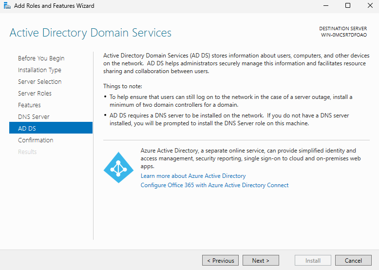

#### Étape 8 : Confirmation avant le lancement
Sur l'écran "Confirmation", on vérifie la liste complète des composants et des consoles qui vont être installés, puis on clique sur le bouton "Installer".

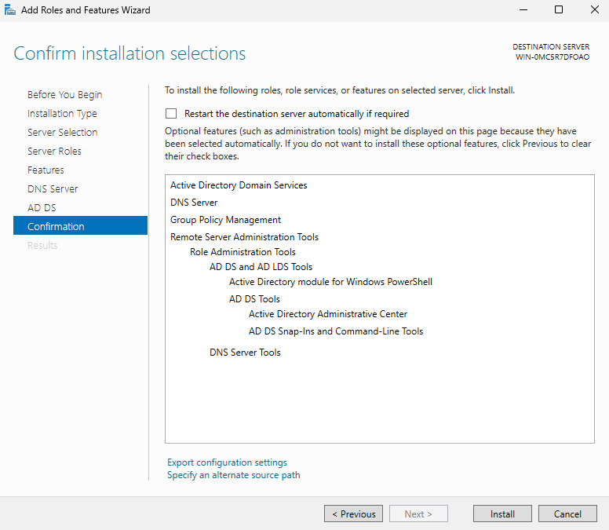

#### Étape 9 : Progression de l'installation
La barre de progression avance pendant que Windows Server copie et installe les fichiers nécessaires aux deux rôles sur le disque.

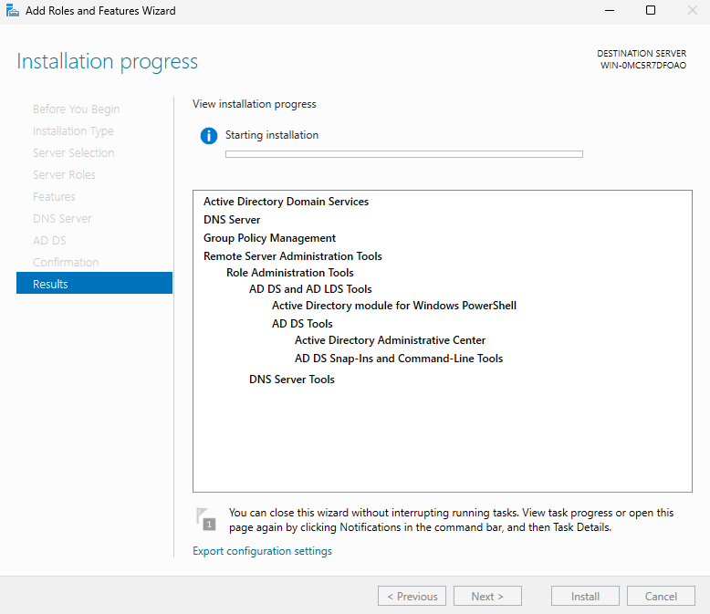

#### Étape 10 : Fin de l'installation des composants
Une fois que l'installation des fichiers est terminée avec succès, on peut quitter cet assistant en cliquant sur le bouton "Close".

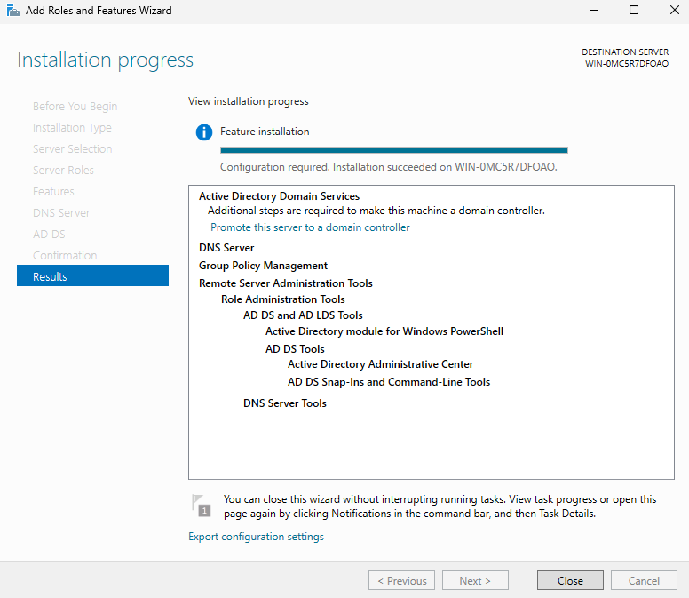

---

### b. Phase 2 : Assistant de Configuration et Promotion du Domaine

Cette deuxième phase permet de configurer la structure logique de notre annuaire Active Directory.

#### Étape 11 : Notification dans le Gestionnaire de serveur
De retour sur le tableau de bord principal du Gestionnaire de serveur, on remarque qu'un drapeau jaune de notification est apparu en haut à droite de l'interface.

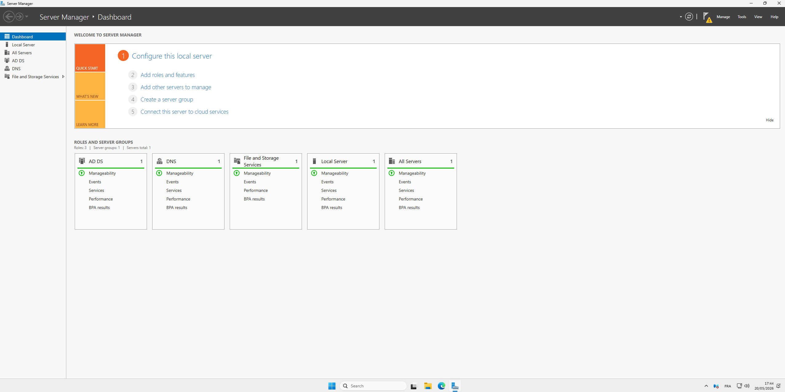

#### Étape 12 : Lancement de la promotion
On clique sur ce drapeau jaune pour ouvrir le menu des tâches post-déploiement, puis on clique sur le lien "Promouvoir ce serveur en contrôleur de domaine" (Promote this server to a domain controller).

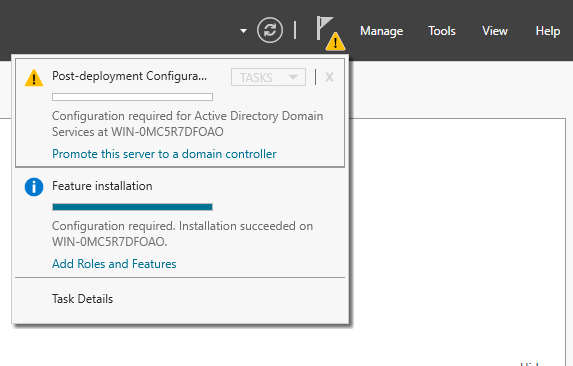

#### Étape 13 : Configuration du déploiement de la forêt
L'assistant de promotion s'ouvre sur l'écran "Deployment Configuration". Comme il s'agit du tout premier serveur de notre réseau, on coche "Ajouter une nouvelle forêt" (Add a new forest) et on saisit le nom obligatoire : `tssr.lan`.

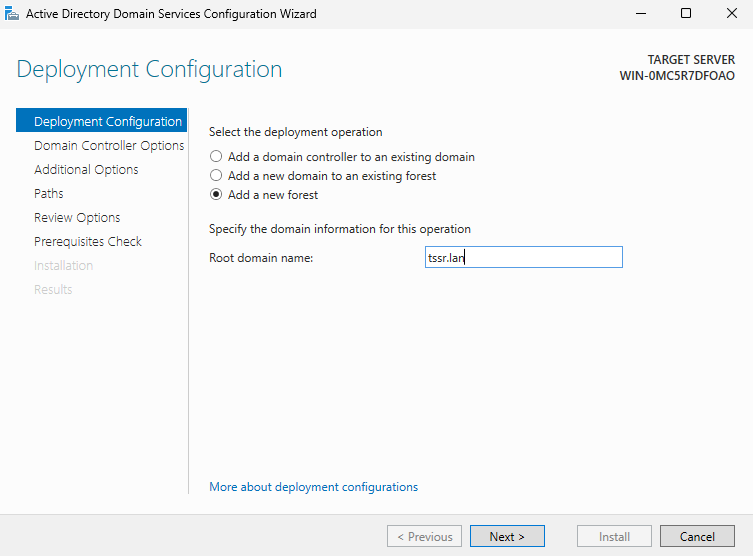

#### Étape 14 : Options du contrôleur de domaine et mot de passe DSRM
Sur l'écran "Domain Controller Options", on conserve le niveau fonctionnel par défaut. On s'assure que les cases DNS et Catalogue Global sont cochées, puis on écrit un mot de passe sécurisé pour le mode de restauration de secours (DSRM).

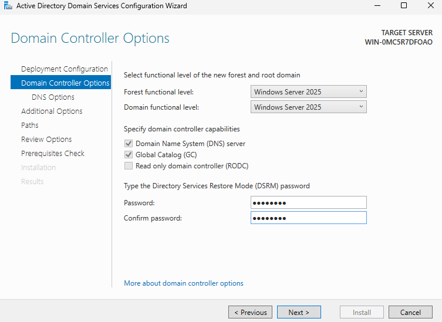

#### Étape 15 : Options DNS (Message d'avertissement)
L'écran "DNS Options" affiche un message concernant la délégation DNS. Cet avertissement est tout à fait normal lors de la création d'une nouvelle zone racine isolée. On clique sur Suivant.

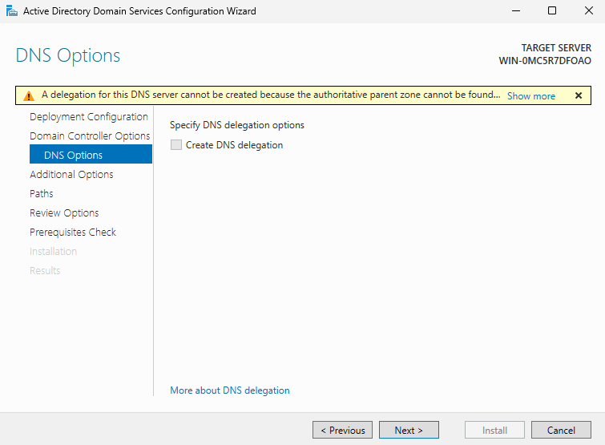

#### Étape 16 : Nom NetBIOS du domaine
Sur l'écran "Additional Options", le système examine notre saisie et attribue automatiquement le nom NetBIOS de notre domaine. On vérifie qu'il indique bien `TSSR` en majuscules.

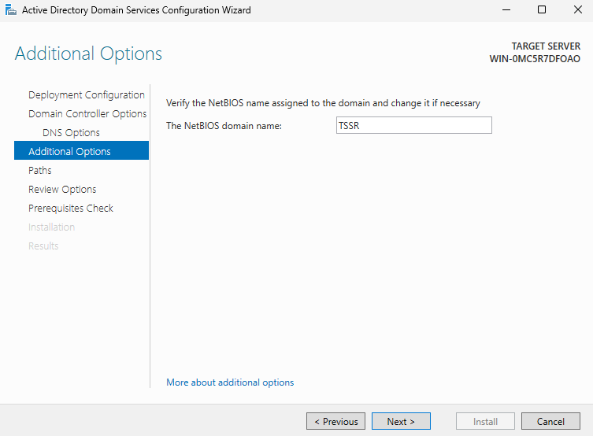

#### Étape 17 : Examen des options choisies
L'écran "Review Options" affiche un résumé complet de tous les choix et paramètres techniques que nous avons configurés avant de lancer définitivement l'écriture sur le serveur.

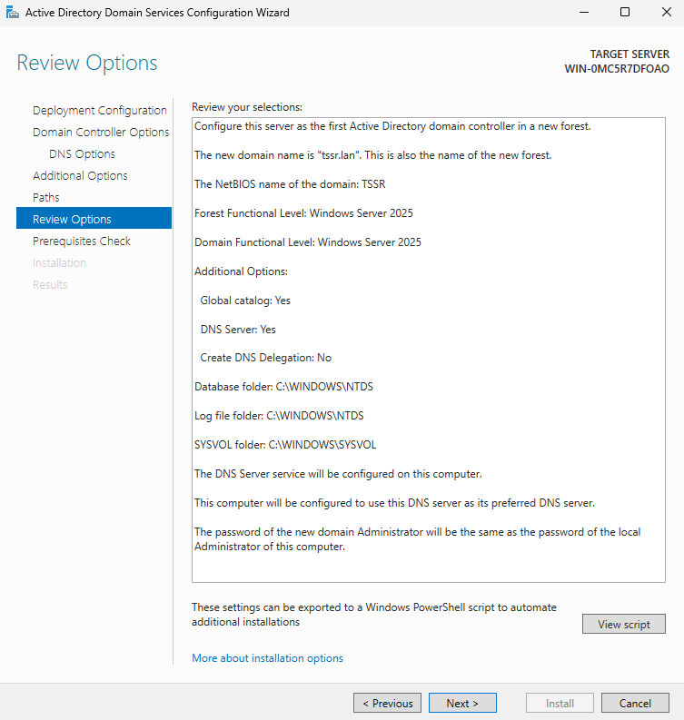

#### Étape 18 : Vérification des prérequis et installation
Sur l'écran "Prerequisites Check", le système fait ses dernières vérifications de sécurité. Dès que l'icône de validation verte apparaît en haut pour confirmer la conformité, on clique sur le bouton "Installer". Le serveur configure le domaine puis redémarre automatiquement.

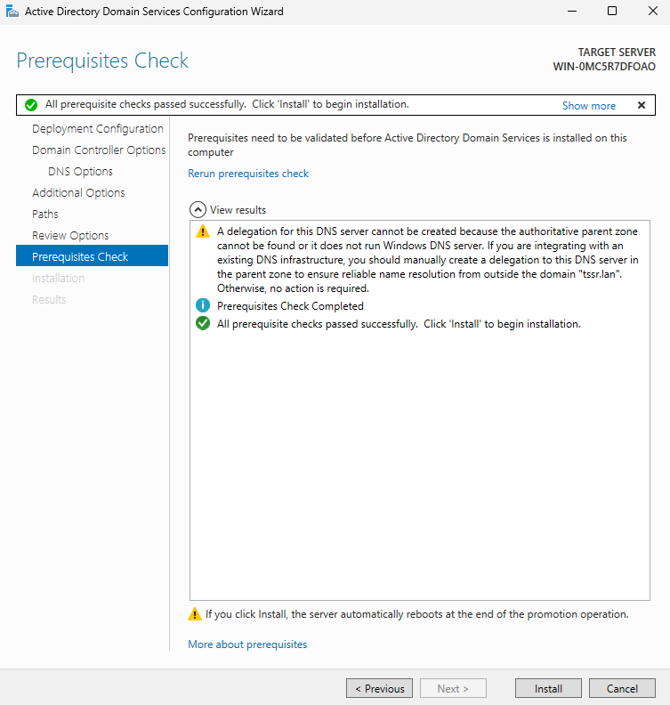

---

### c. Phase 3 : Finalisation, Redémarrage et Validation

#### Étape 19 : Notification de redémarrage automatique
Une fois la configuration terminée, une boîte de dialogue Windows s'affiche pour indiquer que la machine va se déconnecter et redémarrer automatiquement pour appliquer les modifications de l'Active Directory.

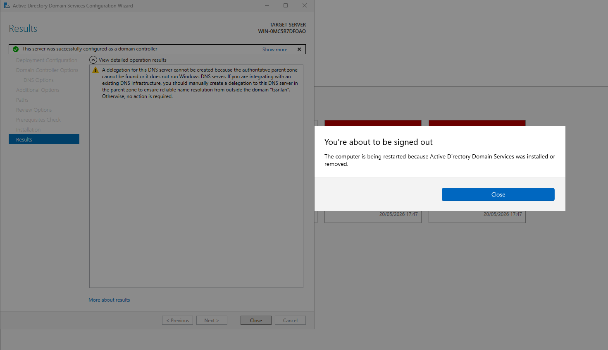

#### Étape 20 : Connexion au domaine d'entreprise
Après le redémarrage du serveur, on constate le succès de l'opération sur l'écran de verrouillage Windows qui propose désormais de se connecter avec le compte administrateur du domaine sous la forme `TSSR\Administrateur`.

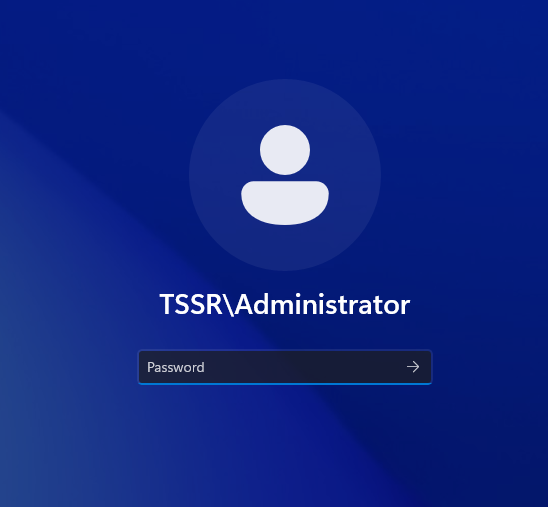

#### Étape 21 : Validation du Gestionnaire de serveur opérationnel
Une fois la session ouverte, le tableau de bord du Gestionnaire de serveur s'affiche. On valide que les briques technologiques "AD DS" et "DNS" sont bien présentes, actives et totalement fonctionnelles dans le menu latéral gauche.

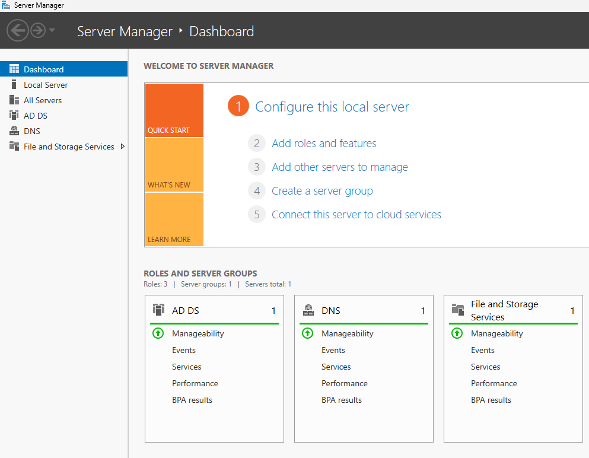
