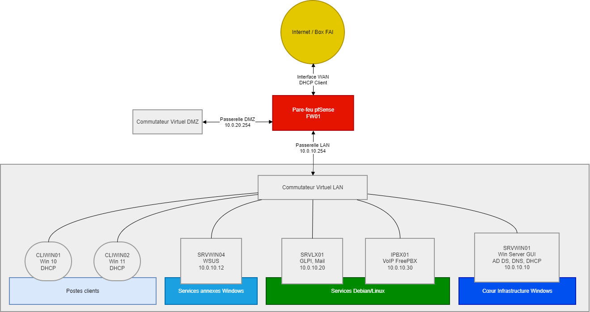

# Projet d'Infrastructure Réseau - EcoTech Solutions

## Sommaire
1. [Présentation du Projet](#1-présentation-du-projet)
2. [Nomenclature et Convention de Nommage](#2-nomenclature-et-convention-de-nommage)
3. [Plan d'Adressage IP et Segmentation](#3-plan-dadressage-ip-et-segmentation)
4. [Architecture de l'Annuaire (OU)](#4-architecture-de-lannuaire-ou)
5. [Liste du Matériel et Configuration des VM](#5-liste-du-matériel-et-configuration-des-vm)
6. [Schéma Réseau de l'Infrastructure](#6-schéma-réseau-de-linfrastructure)

---

## 1. Présentation du projet
Ce projet consiste en la conception et le déploiement d'une infrastructure réseau complète pour la société **EcoTech Solutions**. L'objectif est de migrer d'un environnement non managé vers une architecture centralisée sous Windows Server 2025 et Debian, sécurisée par un pare-feu pfSense.

### Contexte de l'entreprise
- **Effectif** : 245 collaborateurs répartis en 7 départements.
- **Localisation** : Bordeaux.
- **Parc matériel** : 100 % de PC portables.

---

## 2. Nomenclature et convention de nommage

### 2.1. Domaine
- **Nom FQDN** : `tssr.lan`

### 2.2. Serveurs et équipements

- **FW01** : Pare-feu pfSense.
- **SRVWIN01** : DC Principal (AD-DS, DNS, DHCP).
- **SRVWIN04** : Serveur de mises à jour (WSUS).
- **SRVLX01** : Serveur Linux (GLPI, Messagerie).
- **IPBX01** : Serveur VoIP (FreePBX).

### 2.3. Postes clients

- **CLIWIN01** : Poste Windows 11 Pro.
- **CLIWIN02** : Poste Windows 11 Pro.

### 2.4. Objets Active Directory
- **Utilisateurs** : `<2_premières_lettres_prénom><nom>` (ex: `alroux`).

- **Groupes (AGDLP)** : 
  - Globaux : `G_G_<NomDepartement>` (ex: `G_G_DSI`).
  - Domaine Local : `G_DL_<Ressource>_<Droits>` (ex: `G_DL_PartageIT_RW`).

- **GPO** : `GPO_<Cible>_<Fonction>` (ex: `GPO_U_RestrictionHoraires`).

---

## 3. Plan d'adressage IP et segmentation

### 3.1. Zone WAN (Accès Internet)
- **Interface WAN Pare-feu** : IP dynamique via DHCP (Box FAI).

### 3.2. Zone LAN (Réseau Interne sécurisé) - 172.16.20.0/24
- **Interface LAN pfSense (Passerelle)** : `172.16.20.254`
- **Plage Serveurs (IP Fixes)** : `172.16.20.1` à `172.16.20.50`
  - *SRVWIN01* (AD DS, DNS, DHCP) : `172.16.20.10`
  - *SRVWIN04* (WSUS) : `172.16.20.12`
  - *SRVLX01* (GLPI, Messagerie) : `172.16.20.20`
  - *IPBX01* (VoIP FreePBX) : `172.16.20.30`
- **Plage Clients (DHCP)** : `172.16.20.100` à `172.16.20.200`

### 3.3. Zone DMZ (Zone exposée) - 172.16.30.0/24
- **Interface DMZ pfSense (Passerelle)** : `172.16.30.254`
- **Serveur Web Externe** : `172.16.30.10`

---

## 4. Architecture de l'annuaire (OU)
Structure hiérarchique au sein de l'OU racine `OU_EcoTech` :
- **OU_Utilisateurs**
    - `OU_Commercial`, `OU_Communication`, `OU_Developpement`, `OU_Direction`, `OU_DSI`, `OU_Finance`, `OU_RH`.
 
- **OU_Ordinateurs**
  
- **OU_Serveurs**
  
- **OU_Groupes**

---

## 5. Liste du matériel et configuration des VM

| Nom VM | Rôles et OS | Interconnexions et Interfaces | Paramètres IP | Comptes par défaut |
| :--- | :--- | :--- | :--- | :--- |
| **FW01** | pfSense (Routage / Pare-feu) | - Adaptateur 1 : WAN (Pont Box) - Adaptateur 2 : LAN (Réseau Interne) - Adaptateur 3 : DMZ (Réseau Interne) | - DHCP (Côté FAI) - 172.16.20.254/24 (LAN) - 172.16.30.254/24 (DMZ) | `admin` / `pfsense` |
| **SRVWIN01** | DC Principal (AD DS, DNS, DHCP) - Win Server 2022 GUI | Adaptateur 1 : LAN (Réseau Interne) | 172.16.20.10/24 Passerelle : 172.16.20.254 DNS : 127.0.0.1 | `administrator` / `Azerty1*` |
| **SRVWIN04** | Serveur de mises à jour (WSUS) - Win Server 2022 GUI | Adaptateur 1 : LAN (Réseau Interne) | 172.16.20.12/24 Passerelle : 172.16.20.254 DNS : 172.16.20.10 | `administrator` / `Azerty1*` |
| **SRVLX01** | Serveur GLPI et Messagerie - Debian CLI | Adaptateur 1 : LAN (Réseau Interne) | 172.16.20.20/24 Passerelle : 172.16.20.254 DNS : 172.16.20.10 | `root` / `Azerty1*` |
| **IPBX01** | Serveur VoIP - FreePBX | Adaptateur 1 : LAN (Réseau Interne) | 172.16.20.30/24 Passerelle : 172.16.20.254 DNS : 172.16.20.10 | `root` / `Azerty1*` |
| **CLIWIN01** | Poste de travail - Windows 10 Pro | Adaptateur 1 : LAN (Réseau Interne) | DHCP (Plage 172.16.20.100 - 200) | `wilder` / `Azerty1*` |
| **CLIWIN02** | Poste de travail - Windows 11 Pro | Adaptateur 1 : LAN (Réseau Interne) | DHCP (Plage 172.16.20.100 - 200) | `wilder` / `Azerty1*` |

---

## 6. Schéma réseau de l'infrastructure

---

## 7. Journal de bord et suivi de projet

### Choix techniques
* **Hyperviseur** : Oracle VirtualBox

### Difficultés rencontrées

### Solutions et alternatives

### Améliorations possibles
